# Catálogo visual de iconos CATGIS

## Barra principal

| Icono | Nombre | Tooltip / función rápida | Archivo |
|---|---|---|---|
|  | Abrir proyecto | Abrir proyecto | `barra-principal-abrir-proyecto.png` |
|  | Abrir tabla de atributos | Abrir tabla de atributos | `barra-principal-abrir-tabla-de-atributos.png` |
|  | Acercar | Acercar | `barra-principal-acercar.png` |
|  | Agregar capa al proyecto actual | Agregar capa al proyecto actual | `barra-principal-agregar-capa-al-proyecto-actual.png` |
|  | Alejar | Alejar | `barra-principal-alejar.png` |
|  | Buscar por coordenadas | Buscar por coordenadas | `barra-principal-buscar-por-coordenadas.png` |
|  | Cancelar dibujo o medicion | Cancelar dibujo o medicion | `barra-principal-cancelar-dibujo-o-medicion.png` |
|  | Cargar tabla externa | Cargar tabla externa | `barra-principal-cargar-tabla-externa.png` |
|  | Consultar entidades | Consultar entidades | `barra-principal-consultar-entidades.png` |
|  | Conversor de coordenadas | Conversor de coordenadas | `barra-principal-conversor-de-coordenadas.png` |
|  | Crear nueva capa vectorial | Crear nueva capa vectorial | `barra-principal-crear-nueva-capa-vectorial.png` |
|  | Definir CRS del proyecto | Definir CRS del proyecto | `barra-principal-definir-crs-del-proyecto.png` |
|  | Desplazar mapa | Desplazar mapa | `barra-principal-desplazar-mapa.png` |
| 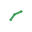 | Dibujar lineas | Dibujar lineas | `barra-principal-dibujar-lineas.png` |
| 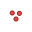 | Dibujar multipunto | Dibujar multipunto | `barra-principal-dibujar-multipunto.png` |
|  | Dibujar poligonos | Dibujar poligonos | `barra-principal-dibujar-poligonos.png` |
|  | Dibujar puntos | Dibujar puntos | `barra-principal-dibujar-puntos.png` |
|  | Finalizar dibujo o medicion | Finalizar dibujo o medicion | `barra-principal-finalizar-dibujo-o-medicion.png` |
|  | Gestor de modulos | Gestor de modulos | `barra-principal-gestor-de-modulos.png` |
|  | Guardar proyecto | Guardar proyecto | `barra-principal-guardar-proyecto.png` |
|  | Guardar proyecto como... | Guardar proyecto como... | `barra-principal-guardar-proyecto-como....png` |
|  | Medir area | Medir area | `barra-principal-medir-area.png` |
|  | Medir distancia | Medir distancia | `barra-principal-medir-distancia.png` |
|  | Salvar vista del mapa | Salvar vista del mapa | `barra-principal-salvar-vista-del-mapa.png` |
|  | Vista anterior | Vista anterior | `barra-principal-vista-anterior.png` |
|  | Vista siguiente | Vista siguiente | `barra-principal-vista-siguiente.png` |
|  | Zoom a capa seleccionada | Zoom a capa seleccionada | `barra-principal-zoom-a-capa-seleccionada.png` |
|  | Zoom a todas las capas | Zoom a todas las capas | `barra-principal-zoom-a-todas-las-capas.png` |
## Cartografía

| Icono | Nombre | Tooltip / función rápida | Archivo |
|---|---|---|---|
|  | Abrir CATMAP | Sin tooltip documentado | `cartografia-abrir-catmap.png` |
|  | Activar Esri World Imagery | Activar Esri World Imagery | `cartografia-activar-esri-world-imagery.png` |
|  | Activar Esri World Topo | Activar Esri World Topo | `cartografia-activar-esri-world-topo.png` |
|  | Activar OpenStreetMap | Activar OpenStreetMap | `cartografia-activar-openstreetmap.png` |
|  | Agregar servicio WMS | Agregar servicio WMS | `cartografia-agregar-servicio-wms.png` |
| 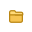 | Elegir mapa base online | Elegir mapa base online | `cartografia-elegir-mapa-base-online.png` |
## Conexiones online

| Icono | Nombre | Tooltip / función rápida | Archivo |
|---|---|---|---|
|  | Activar Esri World Imagery | Activar Esri World Imagery | `conexiones-online-activar-esri-world-imagery.png` |
|  | Activar OpenStreetMap | Activar OpenStreetMap | `conexiones-online-activar-openstreetmap.png` |
|  | Agregar servicio WMS | Agregar servicio WMS | `conexiones-online-agregar-servicio-wms.png` |
|  | Elegir mapa base online | Elegir mapa base online | `conexiones-online-elegir-mapa-base-online.png` |
## Edición vectorial

| Icono | Nombre | Tooltip / función rápida | Archivo |
|---|---|---|---|
|  | Acortar linea | Acortar linea | `edicion-vectorial-acortar-linea.png` |
| 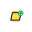 | Aumentar superficie | Aumentar superficie | `edicion-vectorial-aumentar-superficie.png` |
|  | Borrar elemento seleccionado | Borrar elemento seleccionado | `edicion-vectorial-borrar-elemento-seleccionado.png` |
|  | Borrar vertice | Borrar vertice | `edicion-vectorial-borrar-vertice.png` |
|  | Cancelar | Cancelar | `edicion-vectorial-cancelar.png` |
|  | Continuar edicion de linea | Continuar edicion de linea | `edicion-vectorial-continuar-edicion-de-linea.png` |
|  | Copiar elementos seleccionados | Copiar elementos seleccionados | `edicion-vectorial-copiar-elementos-seleccionados.png` |
| 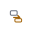 | Copiar elementos seleccionados a la capa en edicion | Copiar elementos seleccionados a la capa en edicion | `edicion-vectorial-copiar-elementos-seleccionados-a-la-capa-en-edicion.png` |
| 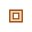 | Crear agujero | Crear agujero | `edicion-vectorial-crear-agujero.png` |
|  | Deshacer | Deshacer | `edicion-vectorial-deshacer.png` |
|  | Dibujar circulo | Dibujar circulo | `edicion-vectorial-dibujar-circulo.png` |
|  | Dibujar circulo por 3 puntos | Dibujar circulo por 3 puntos | `edicion-vectorial-dibujar-circulo-por-3-puntos.png` |
|  | Dibujar linea | Dibujar linea | `edicion-vectorial-dibujar-linea.png` |
|  | Dibujar multipunto | Dibujar multipunto | `edicion-vectorial-dibujar-multipunto.png` |
|  | Dibujar poligono | Dibujar poligono | `edicion-vectorial-dibujar-poligono.png` |
|  | Dibujar punto | Dibujar punto | `edicion-vectorial-dibujar-punto.png` |
|  | Dibujar rectangulo | Dibujar rectangulo | `edicion-vectorial-dibujar-rectangulo.png` |
|  | Disminuir superficie | Disminuir superficie | `edicion-vectorial-disminuir-superficie.png` |
|  | Dividir linea o cortar geometria | Dividir linea o cortar geometria | `edicion-vectorial-dividir-linea-o-cortar-geometria.png` |
|  | Dividir poligono | Dividir poligono | `edicion-vectorial-dividir-poligono.png` |
|  | Explotar entidades seleccionadas | Explotar entidades seleccionadas | `edicion-vectorial-explotar-entidades-seleccionadas.png` |
|  | Extender linea | Extender linea | `edicion-vectorial-extender-linea.png` |
|  | Generar poligono adyacente | Generar poligono adyacente | `edicion-vectorial-generar-poligono-adyacente.png` |
|  | Insertar vertice | Insertar vertice | `edicion-vectorial-insertar-vertice.png` |
|  | Limpiar seleccion | Limpiar seleccion | `edicion-vectorial-limpiar-seleccion.png` |
|  | Linea paralela / desplazamiento lateral | Linea paralela / desplazamiento lateral | `edicion-vectorial-linea-paralela-desplazamiento-lateral.png` |
|  | Linea perpendicular | Linea perpendicular | `edicion-vectorial-linea-perpendicular.png` |
|  | Mover elementos seleccionados | Mover elementos seleccionados | `edicion-vectorial-mover-elementos-seleccionados.png` |
|  | Mover mapa | Mover mapa | `edicion-vectorial-mover-mapa.png` |
| 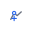 | Mover vertice | Mover vertice | `edicion-vectorial-mover-vertice.png` |
|  | Opciones de capa | Opciones de capa | `edicion-vectorial-opciones-de-capa.png` |
|  | Pegar elementos en la capa en edicion | Pegar elementos en la capa en edicion | `edicion-vectorial-pegar-elementos-en-la-capa-en-edicion.png` |
|  | Rehacer | Rehacer | `edicion-vectorial-rehacer.png` |
|  | Salvar cambios | Salvar cambios | `edicion-vectorial-salvar-cambios.png` |
| 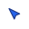 | Seleccionar elemento de la capa editable | Seleccionar elemento de la capa editable | `edicion-vectorial-seleccionar-elemento-de-la-capa-editable.png` |
|  | Terminar | Terminar | `edicion-vectorial-terminar.png` |
|  | Unir elementos | Unir elementos | `edicion-vectorial-unir-elementos.png` |
| 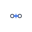 | Unir vertices | Unir vertices | `edicion-vectorial-unir-vertices.png` |
|  | Ver o editar atributos | Ver o editar atributos | `edicion-vectorial-ver-o-editar-atributos.png` |
|  | Zoom al elemento seleccionado | Zoom al elemento seleccionado | `edicion-vectorial-zoom-al-elemento-seleccionado.png` |
## Menú principal / Archivo

| Icono | Nombre | Tooltip / función rápida | Archivo |
|---|---|---|---|
|  | Abrir proyecto | Sin tooltip documentado | `menu-principal-archivo-abrir-proyecto.png` |
|  | Agregar capa | Sin tooltip documentado | `menu-principal-archivo-agregar-capa.png` |
|  | Cargar datos DEM... | Sin tooltip documentado | `menu-principal-archivo-cargar-datos-dem....png` |
| 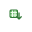 | Cargar tabla externa | Sin tooltip documentado | `menu-principal-archivo-cargar-tabla-externa.png` |
|  | DEM online... | Sin tooltip documentado | `menu-principal-archivo-dem-online....png` |
|  | Guardar proyecto | Sin tooltip documentado | `menu-principal-archivo-guardar-proyecto.png` |
|  | Guardar proyecto como... | Sin tooltip documentado | `menu-principal-archivo-guardar-proyecto-como....png` |
|  | Nueva capa vectorial | Sin tooltip documentado | `menu-principal-archivo-nueva-capa-vectorial.png` |
|  | Nuevo proyecto | Sin tooltip documentado | `menu-principal-archivo-nuevo-proyecto.png` |
|  | Salvar vista del mapa | Sin tooltip documentado | `menu-principal-archivo-salvar-vista-del-mapa.png` |
## Menú principal / Ayuda

| Icono | Nombre | Tooltip / función rápida | Archivo |
|---|---|---|---|
|  | Acerca de CATGIS | Sin tooltip documentado | `menu-principal-ayuda-acerca-de-catgis.png` |
|  | Panel de ayuda | Sin tooltip documentado | `menu-principal-ayuda-panel-de-ayuda.png` |
## Menú principal / CAD

| Icono | Nombre | Tooltip / función rápida | Archivo |
|---|---|---|---|
| 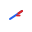 | Acortar linea | Sin tooltip documentado | `menu-principal-cad-acortar-linea.png` |
|  | Capas internas CAD... | Sin tooltip documentado | `menu-principal-cad-capas-internas-cad....png` |
|  | Circulo | Sin tooltip documentado | `menu-principal-cad-circulo.png` |
|  | Circulo por 3 puntos | Sin tooltip documentado | `menu-principal-cad-circulo-por-3-puntos.png` |
|  | Continuar linea | Sin tooltip documentado | `menu-principal-cad-continuar-linea.png` |
| 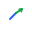 | Extender linea | Sin tooltip documentado | `menu-principal-cad-extender-linea.png` |
|  | Georreferenciar capa CAD seleccionada... | Sin tooltip documentado | `menu-principal-cad-georreferenciar-capa-cad-seleccionada....png` |
|  | Integracion DWG / CAD... | Sin tooltip documentado | `menu-principal-cad-integracion-dwg-cad....png` |
| 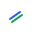 | Paralela / desplazamiento lateral | Sin tooltip documentado | `menu-principal-cad-paralela-desplazamiento-lateral.png` |
| 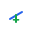 | Perpendicular | Sin tooltip documentado | `menu-principal-cad-perpendicular.png` |
|  | Rectangulo | Sin tooltip documentado | `menu-principal-cad-rectangulo.png` |
## Menú principal / Cartografia

| Icono | Nombre | Tooltip / función rápida | Archivo |
|---|---|---|---|
|  | Abrir CATMAP... | Sin tooltip documentado | `menu-principal-cartografia-abrir-catmap....png` |
|  | Simbologia de capa seleccionada... | Sin tooltip documentado | `menu-principal-cartografia-simbologia-de-capa-seleccionada....png` |
|  | Simbologia por campo... | Sin tooltip documentado | `menu-principal-cartografia-simbologia-por-campo....png` |
## Menú principal / Edicion

| Icono | Nombre | Tooltip / función rápida | Archivo |
|---|---|---|---|
|  | Borrar selección | Sin tooltip documentado | `menu-principal-edicion-borrar-seleccion.png` |
|  | Cancelar edición | Sin tooltip documentado | `menu-principal-edicion-cancelar-edicion.png` |
|  | Copiar selección | Sin tooltip documentado | `menu-principal-edicion-copiar-seleccion.png` |
|  | Copiar selección a capa editable | Sin tooltip documentado | `menu-principal-edicion-copiar-seleccion-a-capa-editable.png` |
|  | Cortar geometría | Sin tooltip documentado | `menu-principal-edicion-cortar-geometria.png` |
|  | Cortar selección | Sin tooltip documentado | `menu-principal-edicion-cortar-seleccion.png` |
|  | Deshacer | Sin tooltip documentado | `menu-principal-edicion-deshacer.png` |
|  | Explotar entidades seleccionadas | Sin tooltip documentado | `menu-principal-edicion-explotar-entidades-seleccionadas.png` |
|  | Guardar cambios de edición | Sin tooltip documentado | `menu-principal-edicion-guardar-cambios-de-edicion.png` |
|  | Mover selección | Sin tooltip documentado | `menu-principal-edicion-mover-seleccion.png` |
|  | Pegar en capa editable | Sin tooltip documentado | `menu-principal-edicion-pegar-en-capa-editable.png` |
|  | Rehacer | Sin tooltip documentado | `menu-principal-edicion-rehacer.png` |
|  | Terminar edición | Sin tooltip documentado | `menu-principal-edicion-terminar-edicion.png` |
|  | Unir elementos seleccionados | Sin tooltip documentado | `menu-principal-edicion-unir-elementos-seleccionados.png` |
|  | Unir vértices | Sin tooltip documentado | `menu-principal-edicion-unir-vertices.png` |
## Menú principal / Herramientas

| Icono | Nombre | Tooltip / función rápida | Archivo |
|---|---|---|---|
|  | Analisis topohidrologico... | Sin tooltip documentado | `menu-principal-herramientas-analisis-topohidrologico....png` |
|  | Asignar valor a un campo | Sin tooltip documentado | `menu-principal-herramientas-asignar-valor-a-un-campo.png` |
|  | Buscar por coordenadas | Sin tooltip documentado | `menu-principal-herramientas-buscar-por-coordenadas.png` |
| 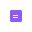 | Calculadora de campos | Sin tooltip documentado | `menu-principal-herramientas-calculadora-de-campos.png` |
|  | Cancelar | Sin tooltip documentado | `menu-principal-herramientas-cancelar.png` |
|  | Constructor de consultas | Sin tooltip documentado | `menu-principal-herramientas-constructor-de-consultas.png` |
| 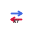 | Conversor CRS / EPSG | Sin tooltip documentado | `menu-principal-herramientas-conversor-crs-epsg.png` |
|  | Cuenca desde outlet... | Sin tooltip documentado | `menu-principal-herramientas-cuenca-desde-outlet....png` |
|  | Dibujar línea | Sin tooltip documentado | `menu-principal-herramientas-dibujar-linea.png` |
|  | Dibujar multipunto | Sin tooltip documentado | `menu-principal-herramientas-dibujar-multipunto.png` |
|  | Dibujar polígono | Sin tooltip documentado | `menu-principal-herramientas-dibujar-poligono.png` |
|  | Dibujar punto | Sin tooltip documentado | `menu-principal-herramientas-dibujar-punto.png` |
|  | Dibujar rectangulo | Sin tooltip documentado | `menu-principal-herramientas-dibujar-rectangulo.png` |
| 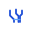 | Generar escorrentias... | Sin tooltip documentado | `menu-principal-herramientas-generar-escorrentias....png` |
|  | Identificar | Sin tooltip documentado | `menu-principal-herramientas-identificar.png` |
|  | Medir distancia | Sin tooltip documentado | `menu-principal-herramientas-medir-distancia.png` |
|  | Medir área | Sin tooltip documentado | `menu-principal-herramientas-medir-area.png` |
| 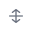 | Mover | Sin tooltip documentado | `menu-principal-herramientas-mover.png` |
|  | Tabla de atributos | Sin tooltip documentado | `menu-principal-herramientas-tabla-de-atributos.png` |
|  | Terminar | Sin tooltip documentado | `menu-principal-herramientas-terminar.png` |
## Menú principal / Modulos

| Icono | Nombre | Tooltip / función rápida | Archivo |
|---|---|---|---|
|  | Gestor de modulos... | Sin tooltip documentado | `menu-principal-modulos-gestor-de-modulos....png` |
## Menú principal / Proyecto

| Icono | Nombre | Tooltip / función rápida | Archivo |
|---|---|---|---|
|  | CRS del proyecto | Sin tooltip documentado | `menu-principal-proyecto-crs-del-proyecto.png` |
| 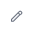 | Renombrar proyecto | Sin tooltip documentado | `menu-principal-proyecto-renombrar-proyecto.png` |
## Menú principal / Ventana

| Icono | Nombre | Tooltip / función rápida | Archivo |
|---|---|---|---|
|  | Constructor de consultas de la capa seleccionada | Sin tooltip documentado | `menu-principal-ventana-constructor-de-consultas-de-la-capa-seleccionada.png` |
|  | Tabla de atributos de la capa seleccionada | Sin tooltip documentado | `menu-principal-ventana-tabla-de-atributos-de-la-capa-seleccionada.png` |
|  | Traer CATGIS al frente | Sin tooltip documentado | `menu-principal-ventana-traer-catgis-al-frente.png` |
|  | Traer tablas abiertas al frente | Sin tooltip documentado | `menu-principal-ventana-traer-tablas-abiertas-al-frente.png` |
## Menú principal / Vista

| Icono | Nombre | Tooltip / función rápida | Archivo |
|---|---|---|---|
|  | Vista anterior | Sin tooltip documentado | `menu-principal-vista-vista-anterior.png` |
|  | Vista siguiente | Sin tooltip documentado | `menu-principal-vista-vista-siguiente.png` |
|  | Zoom + | Sin tooltip documentado | `menu-principal-vista-zoom.png` |
|  | Zoom - | Sin tooltip documentado | `menu-principal-vista-zoom.png` |
|  | Zoom a capa seleccionada | Sin tooltip documentado | `menu-principal-vista-zoom-a-capa-seleccionada.png` |
|  | Zoom a todas las capas | Sin tooltip documentado | `menu-principal-vista-zoom-a-todas-las-capas.png` |
## Topografía

| Icono | Nombre | Tooltip / función rápida | Archivo |
|---|---|---|---|
|  | Calcular escorrentias y red de drenaje desde un DEM | Calcular escorrentias y red de drenaje desde un DEM | `topografia-calcular-escorrentias-y-red-de-drenaje-desde-un-dem.png` |
|  | Cargar datos DEM desde archivos locales | Cargar datos DEM desde archivos locales | `topografia-cargar-datos-dem-desde-archivos-locales.png` |
|  | Combinar DEM y suelos con reglas booleanas preliminares | Combinar DEM y suelos con reglas booleanas preliminares | `topografia-combinar-dem-y-suelos-con-reglas-booleanas-preliminares.png` |
|  | Delimitar una cuenca desde un outlet o pour point | Delimitar una cuenca desde un outlet o pour point | `topografia-delimitar-una-cuenca-desde-un-outlet-o-pour-point.png` |
|  | Descargar mapas de suelos globales y agregarlos al proyecto | Descargar mapas de suelos globales y agregarlos al proyecto | `topografia-descargar-mapas-de-suelos-globales-y-agregarlos-al-proyecto.png` |
|  | Descargar o incorporar un DEM al proyecto | Descargar o incorporar un DEM al proyecto | `topografia-descargar-o-incorporar-un-dem-al-proyecto.png` |
|  | Generar curvas de nivel desde un raster DEM | Generar curvas de nivel desde un raster DEM | `topografia-generar-curvas-de-nivel-desde-un-raster-dem.png` |
|  | Generar hillshade, pendiente, aspecto, flujo, cuencas y flechas desde un DEM | Generar hillshade, pendiente, aspecto, flujo, cuencas y flechas desde un DEM | `topografia-generar-hillshade-pendiente-aspecto-flujo-cuencas-y-flechas-desde-un-dem.png` |
| 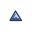 | Generar un escenario preliminar de anegamiento por lluvia | Generar un escenario preliminar de anegamiento por lluvia | `topografia-generar-un-escenario-preliminar-de-anegamiento-por-lluvia.png` |
|  | Generar un perfil topografico desde un DEM | Generar un perfil topografico desde un DEM | `topografia-generar-un-perfil-topografico-desde-un-dem.png` |
|  | Recortar un DEM por vista o mascara poligonal | Recortar un DEM por vista o mascara poligonal | `topografia-recortar-un-dem-por-vista-o-mascara-poligonal.png` |
